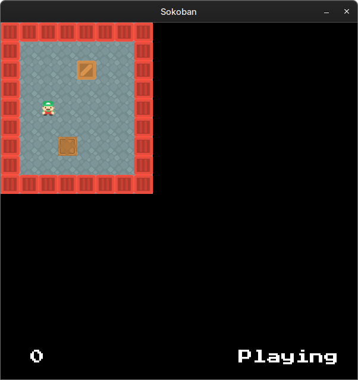

<div>
  <h1 align="center">sokoban</h1>
  <h4 align="center">Rust implementation of Sokoan using ggez and ECS</h4>
</div>

Implementation of Sokoban using the ggez game engine and the ECS pattern with
specs.

# Screenshot

<div align="center" style="display: block; text-align: center;">
  
</div>

# Usage

```bash
git clone https://github.com/EstebanBorai/sokoban.git

cd ./sokoban

cargo run
```

# Controls

Key | Description
--- | ---
<kbd>W</kbd> or <kbd>Up</kbd> | Move north
<kbd>A</kbd> or <kbd>Left</kbd> | Move west
<kbd>S</kbd> or <kbd>Down</kbd> | Move south
<kbd>D</kbd> or <kbd>Right</kbd> | Move east
